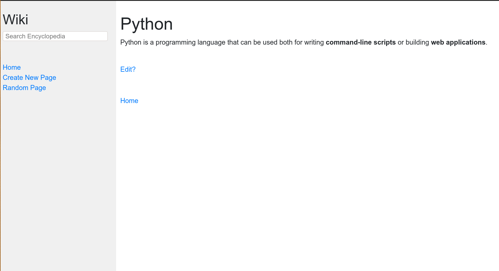

#Wiki
####Second project from cs50 web programming with Python and Javascript.
##Features:
- Search articles.
- Write articles.
- Edit articles.
####This is a full wikipedia site, what wrote the articles in Markdown language, but the visualization is in HTML.
use django

Demonstration:
https://youtu.be/zCrqI9SciMg